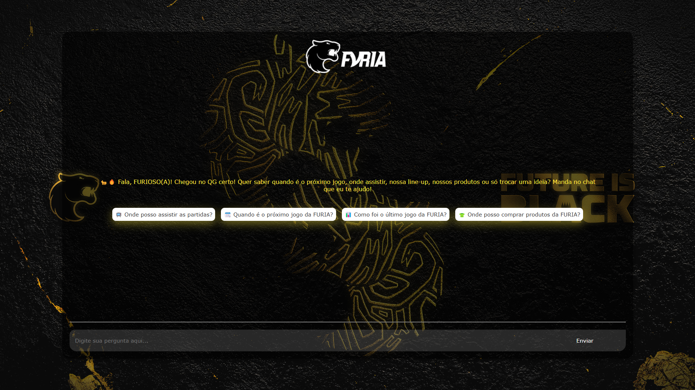

# 🐯 Chatbot FURIA (QG da FURIA) - Experiência Conversacional para Fãs de CS:GO

Este é um projeto desenvolvido para o **Challenge #1 - Experiência Conversacional FURIA**, com o objetivo de criar uma interface interativa e informativa voltada para os fãs do time de CS da FURIA Esports.



## 🎯 Objetivo

Proporcionar uma **experiência conversacional envolvente** para os torcedores, trazendo informações relevantes, curiosidades, notícias, escalações, próximos jogos e outras funcionalidades que aproximam o fã do time.

## 🚀 Funcionalidades

- 🧠 Chatbot inteligente com integração à API da OpenAI
- 🖼️ Interface web responsiva com Next.js
- 📊 Estatística do time
- 📆 Calendário de jogos
- 👥 Informações sobre os jogadores
- 🏪 Informações sobre os produtos da FURIA
- 🧾 Histórico de partidas
- 📺 Onde assistir os jogos

## 📹 Demonstração

O gif a seguir é uma breve demonstração de como utilizar o chat e de exemplos de perguntas para fazer. (Gif acelerado 4x)


## 🧑‍💻 Tecnologias utilizadas

- [Next.js](https://nextjs.org/):
- React.js
- [TypeScript](https://www.typescriptlang.org/)
- AI SDK
- [OpenAI API](https://platform.openai.com/)
- Astra DB
- Node.js

## 📥 Como clonar e usar o projeto

Siga os passos abaixo para clonar, configurar e rodar o chatbot localmente ou em produção.

### Pré-requisitos

Antes de começar, certifique-se de que você tem as seguintes ferramentas instaladas:

- **Node.js** (versão 18 ou superior): [Baixe aqui](https://nodejs.org/).
- **npm**: Gerenciador de pacotes (já vem com o Node.js).
- **Git**: Para clonar o repositório. [Baixe aqui](https://git-scm.com/).
- **Conta na OpenAI**: Para obter uma chave de API (`OPENAI_API_KEY`).
- **Conta na DataStax Astra DB**: Para obter as credenciais do banco de dados vetorial (`ASTRA_DB_*`).

### Passo 1: Clonar o repositório

Clone o repositório para sua máquina local usando o Git:

```bash
git clone https://github.com/seu-usuario/chatbot-furia.git
cd chatbot-furia
```

### Passo 2: Instalar dependências

Instale as dependências do projeto usando o npm:

```bash
npm install
```

Isso instalará todas as bibliotecas necessárias, como `next`, `react`, `@ai-sdk/openai`, `openai`, e `@datastax/astra-db-ts`.

### Passo 3: Configurar variáveis de ambiente

Crie um arquivo `.env` na raiz do projeto e adicione as seguintes variáveis de ambiente:

```env
OPENAI_API_KEY=sk-...
ASTRA_DB_APPLICATION_TOKEN=...
ASTRA_DB_API_ENDPOINT=...
ASTRA_DB_NAMESPACE=...
ASTRA_DB_COLLECTION=...
```

- **Como obter as chaves**:
  - `OPENAI_API_KEY`: Gere uma chave no painel da OpenAI (PRECISA DE CREDITO PARA USA-LA)([https://platform.openai.com/api-keys](https://platform.openai.com/api-keys)).
  - `ASTRA_DB_*`: Crie um banco de dados no Astra DB ([https://astra.datastax.com](https://astra.datastax.com)) e obtenha as credenciais no painel (seção "Connect" > "API Access").

### Passo 4: (Opcional) Carregar dados no Astra DB

Se você precisa carregar dados iniciais no Astra DB (ex.: informações sobre jogos da FURIA), use o script `loadDb.ts`:

```bash
npm run seed
```

O script está localizado em `scripts/loadDb.ts` e usa as variáveis de ambiente do Astra DB para carregar os dados. Certifique-se de que os dados estão no formato correto e que o Astra DB está configurado para suportar busca vetorial.

### Passo 5: Rodar o projeto localmente

Inicie o servidor de desenvolvimento do Next.js:

```bash
npm run dev
```

O projeto estará disponível em `http://localhost:3000`. Abra o endereço no navegador para interagir com o chatbot.

### Passo 6: Testar o chatbot

- No navegador, você verá a interface do chatbot com o logo da FURIA e uma mensagem de boas-vindas.
- Clique em uma das sugestões de prompt (ex.: "📺 Onde posso assistir as partidas?") ou digite sua própria pergunta.
- O chatbot responderá com base nas informações fornecidas e no contexto do Astra DB (se o embedding funcionar).

## PRONTO!! comece a saber mais sobre a FURIA 🐯🔥

## 👩‍💻 Desenvolvido por:

[Raissa Nazaré](https://www.linkedin.com/in/raissanazar%C3%A9/)
